# Raptor AI — System Diagrams & Workflows

> Complete visual reference for understanding Raptor AI's architecture, data flows, and decision-making processes.  
> All diagrams use [Mermaid.js](https://mermaid.js.org/) and render natively on GitHub.

---

## Table of Contents

- [Architecture](#architecture)
  - [High-Level System Architecture](#1-high-level-system-architecture)
  - [Component Interaction Map](#2-component-interaction-map)
  - [Module Dependency Graph](#3-module-dependency-graph)
- [State Machine](#state-machine)
  - [Agent FSM](#4-agent-state-machine)
- [Workflows](#workflows)
  - [Voice Command Execution](#5-voice-command-execution-workflow)
  - [Proactive Monitoring & Alerting](#6-proactive-monitoring--alerting-workflow)
  - [Tool Execution Pipeline](#7-tool-execution-pipeline)
- [Learning System](#learning-system)
  - [Learning & Adaptation Flow](#8-learning--adaptation-flow)
  - [Explainability & User Override](#9-explainability--user-override-flow)
  - [Priority Decision Tree](#10-priority-decision-tree)
- [Advanced Flows](#advanced-flows)
  - [Browser Intelligence Flow](#11-browser-intelligence-flow)
  - [Multi-Tool Chaining Flow](#12-multi-tool-chaining-flow)
  - [System Boot Sequence](#13-system-boot-sequence)

---

## Architecture

### 1. High-Level System Architecture

The core architecture showing all six layers and how data flows from perception to presentation.

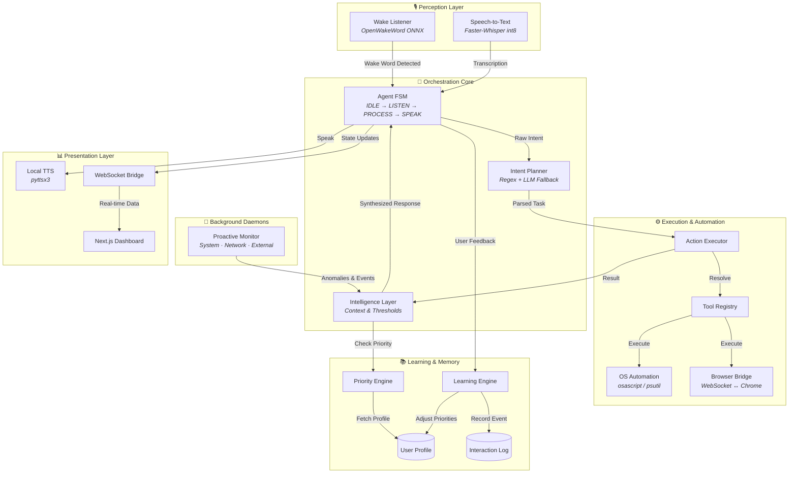

> Shows all six architectural layers and how user voice input flows through planning, execution, and learning before producing a response.

---

### 2. Component Interaction Map

How input sources flow through processing into action domains and output channels.

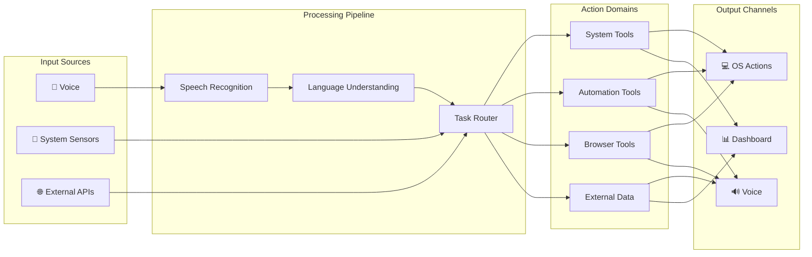

> Maps the three input sources (voice, sensors, APIs) through processing to four action domains and three output channels.

---

### 3. Module Dependency Graph

How the actual Python modules depend on and communicate with each other.

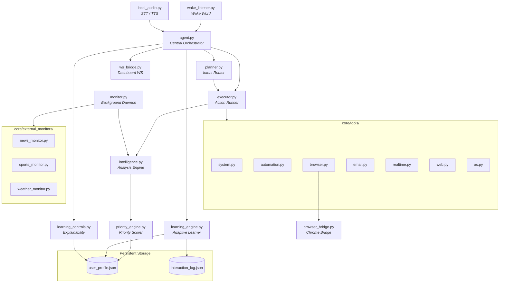

> Shows the actual file-level dependencies. The `agent.py` module sits at the center, delegating to planner, executor, and learning systems.

---

## State Machine

### 4. Agent State Machine

The four primary states of the Agent FSM with all valid transitions.

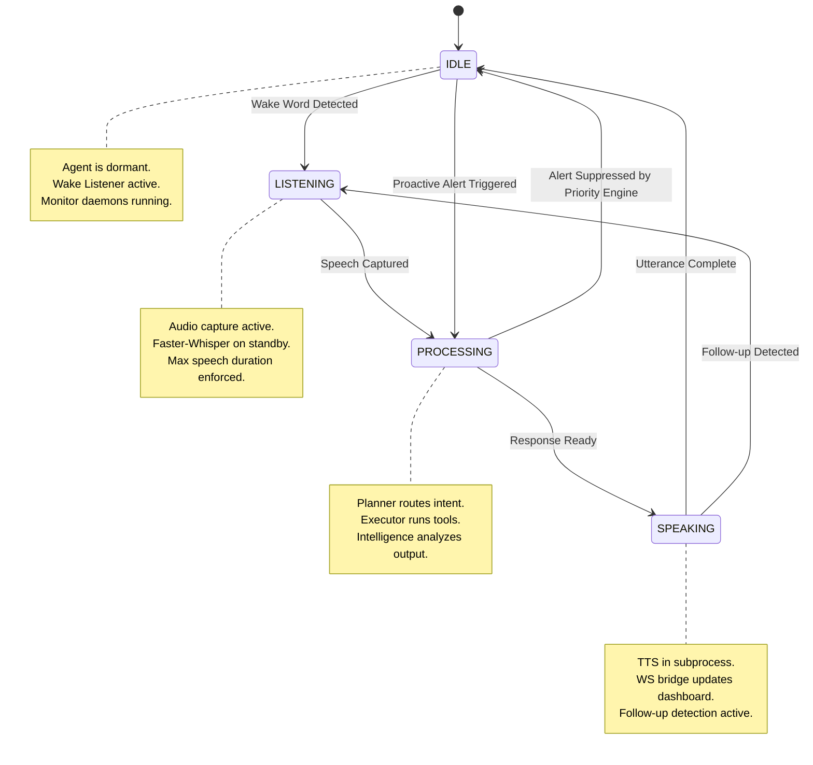

> The agent cycles through IDLE → LISTENING → PROCESSING → SPEAKING. Two special transitions exist: proactive alerts bypass LISTENING, and follow-ups loop from SPEAKING back to LISTENING.

---

## Workflows

### 5. Voice Command Execution Workflow

The complete end-to-end reactive pipeline from wake word to spoken response.

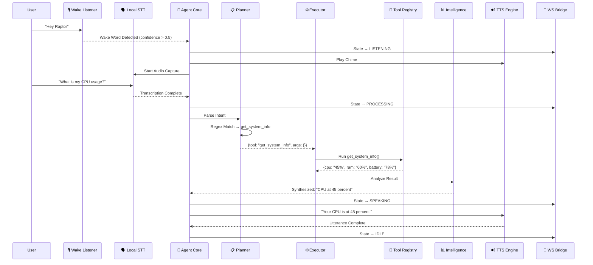

> Full reactive pipeline with WebSocket state broadcasts at each transition. Total latency is under 2 seconds for a fully local pipeline.

---

### 6. Proactive Monitoring & Alerting Workflow

How background daemons detect events, evaluate priority, and adaptively learn from user responses.

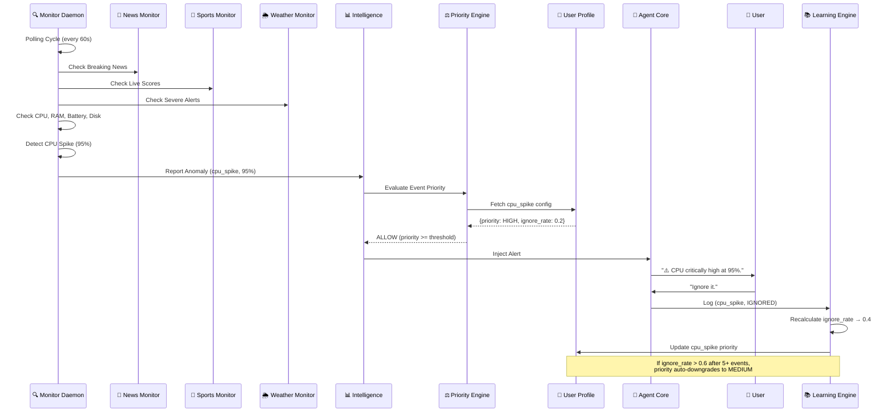

> Demonstrates the full proactive cycle: polling → detection → priority evaluation → user interaction → adaptive learning. The monitor runs independently of voice commands.

---

### 7. Tool Execution Pipeline

Detailed view of how the executor resolves and runs a tool safely.

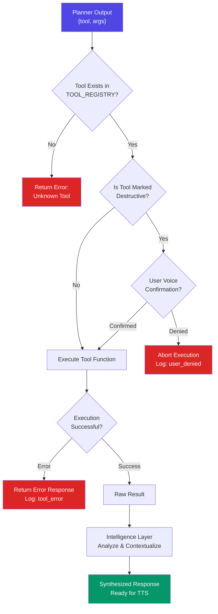

> Shows the safety-first execution model. Destructive tools require explicit voice confirmation. All results pass through the intelligence layer for contextual analysis before being spoken.

---

## Learning System

### 8. Learning & Adaptation Flow

How user interactions shape future alert behavior over time.

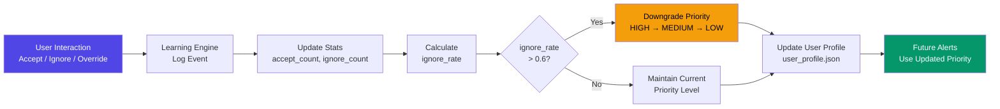

> The learning engine is a feedback loop: every user response is logged, statistics are recalculated, and priority levels automatically adjust. Over time, Raptor learns what matters to you.

---

### 9. Explainability & User Override Flow

How users query the system for transparency and enforce manual overrides.

```mermaid
sequenceDiagram
    participant User as 👤 User
    participant Agent as 🧠 Agent Core
    participant LC as 🔍 Learning Controls
    participant UP as 💾 User Profile

    rect rgb(30, 58, 138)
        Note over User,UP: Query: "Why" Flow
        User->>Agent: "Why don't I get cricket updates?"
        Agent->>LC: detect_learning_intent()
        LC->>UP: Fetch cricket event data
        UP-->>LC: {priority: LOW, ignore_rate: 0.75, total: 4, ignored: 3}
        LC->>LC: Build Explanation String
        LC-->>Agent: "You ignored 3 of 4 cricket alerts.<br/>Priority was auto-reduced to LOW."
        Agent->>User: Speak Explanation
    end

    rect rgb(5, 90, 50)
        Note over User,UP: Override: "Always" Flow
        User->>Agent: "Always notify me about cricket."
        Agent->>LC: detect_learning_intent()
        LC->>LC: Parse → ALWAYS override
        LC->>UP: Set cricket.override = ALWAYS
        LC-->>Agent: Override Confirmed
        Agent->>User: "Done. Cricket alerts set to ALWAYS."
    end

    rect rgb(120, 20, 20)
        Note over User,UP: Override: "Reset" Flow
        User->>Agent: "Reset my preferences."
        Agent->>LC: detect_learning_intent()
        LC->>UP: Clear all learned priorities
        UP-->>LC: Profile Reset
        LC-->>Agent: Reset Confirmed
        Agent->>User: "All preferences have been reset."
    end
```

> Three interaction patterns: querying why an alert was suppressed, setting a manual override, and resetting all learned behavior. All use natural language via `learning_controls.py`.

---

### 10. Priority Decision Tree

How the priority engine decides whether to alert the user for a given event.

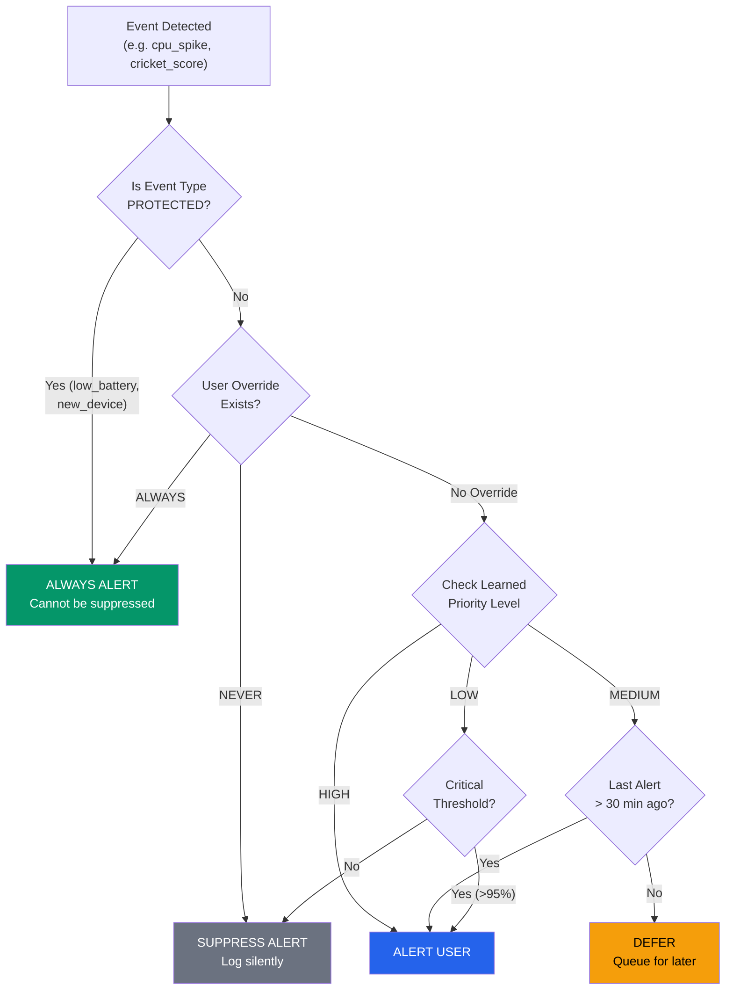

> Decision tree showing how protected events, user overrides, learned priorities, and cooldown timers interact to produce the final alert/suppress decision.

---

## Advanced Flows

### 11. Browser Intelligence Flow

How Raptor communicates with the Chrome extension to perform autonomous web operations.

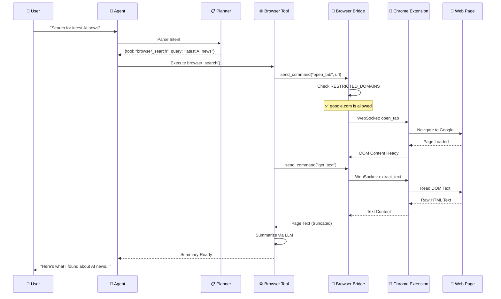

> Shows the complete WebSocket relay chain from user command through the browser bridge to the Chrome extension and back. The restricted domains check prevents automation on sensitive sites.

---

### 12. Multi-Tool Chaining Flow

How future chained workflows will execute multiple tools in sequence.

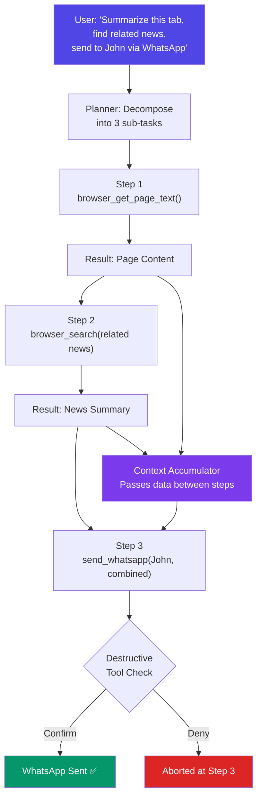

> Future capability: the planner decomposes complex natural language into ordered sub-tasks. A context accumulator passes results between steps. Destructive tools still require confirmation.

---

### 13. System Boot Sequence

What happens when `raptor_launcher.py` starts the agent.

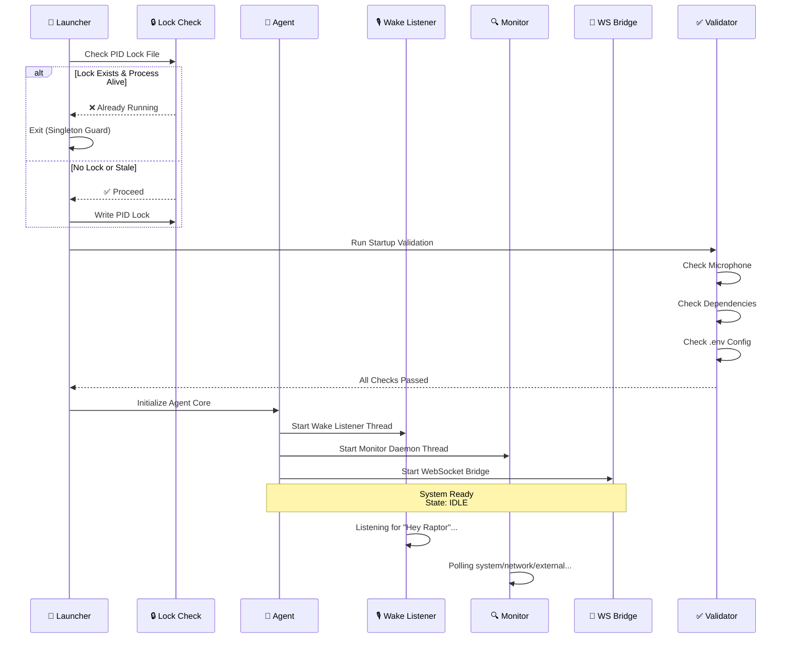

> Shows the watchdog boot sequence: singleton locking prevents duplicate processes, validation checks dependencies, then all subsystems start in parallel threads.

---

*📐 Generated for Raptor AI — see the [main README](../README.md) for setup and usage.*
